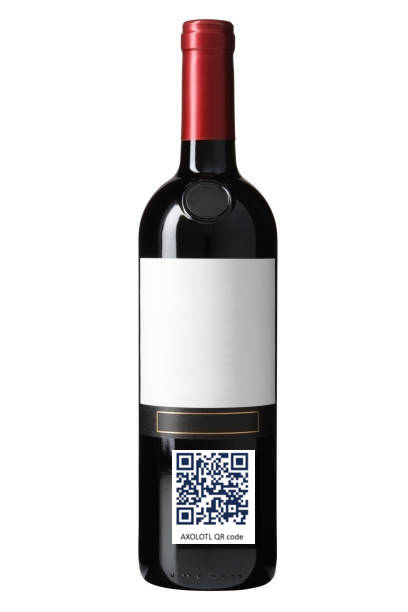

# Submit project "AXOLOTL"

## Manage team

<https://devpost.com/submit-to/12998-codegeist-2021/manage/submissions/255342/manage-team>

1. [Gianpaolo Macario](https://devpost.com/gmacario)
2. [Gianluca Teti](https://devpost.com/gteti)
3. [Rafael Esposito](https://devpost.com/raffoespo)
4. [Luigi Scalzone](https://devpost.com/GGn0)


## Project overview

<https://devpost.com/submit-to/12998-codegeist-2021/manage/submissions/255342/project-overview>

Please respect our [Community Guidelines](https://info.devpost.com/guidelines).

### General info

#### \* Project name

You can change this at any time.

`AXOLOTL` _(max 60 characters)_

#### \* Elevator pitch

Provide a short tagline for the project. You can change this later.

_(max 200 characters)_

```text
When you are opening a bottle of fine wine you may ask where it comes from, or when it was bottled, etc. Just scan your AXOLOTL QR Code and you will know this and more...
You just have to drink!
```

#### \* Thumbnail

_(JPG, PNG or GIF format, 5 MB max file size. For best results, use a 3:2 ratio.)_



[Save &amp; continue](TODO) | [Cancel](TODO)


## Project details

<https://devpost.com/submit-to/12998-codegeist-2021/manage/submissions/255342-axolotl/project_details/edit>

_For public project page_

Information entered below will appear on your public project page.

### Project Story

#### \* About the project

_Be sure to write what inspired you, what you learned, how you built your project, and the challenges you faced._
_Format your story in [Markdown](https://www.markdownguide.org/cheat-sheet/)._

```text
## Inspiration

The project started out of a concrete requirements in our everyday job. However, since we are doing secret stuff in our workday, we pivoted the idea to a project which allows traceability of wine bottles.

## What it does

The app allows to create QR Code programmatically and insert them into a Confluence page. The idea is to use them to attach to physical items (for instance, a wine bottle) so that users of the item can access online, up-to-date information about such item. We demonstrated it with a concrete use case for wine, but of course this is just one example of application.

## How we built it

The AXOLOTL application leverages the
"Forge QR Code" example at
<https://bitbucket.org/atlassian/workspace/projects/FE>.

We made a few small extensions to the original sources, for instance the capability to render not just the QR Code but also a few additional attributes in cleartext. This can hint end users that they may get more details by scanning the QR Code.

## Challenges we ran into

Mostly time... We assumed we had more spare time over the weekend, but this was not the case. For instance, one of us was busy harvesting grapes at the in-laws vineyard - by the way, that was the main inspiration for the app :-) 

## Accomplishments that we're proud of

That we managed to complete the submission just a couple of hours before the deadline...

## What we learned

That planning is essential to hit milestones!

## What's next for AXOLOTL

Who knows? Maybe we will extend the project for our actual use cases in our main job?
```

#### \* Built with

_What languages, frameworks, platforms, cloud services, databases, APIs, or other technologies did you use?_

```text
We developed the code for this project in [JavaScript](https://www.javascript.com/)
and [TypeScript](https://www.typescriptlang.org/) 
using [Node.js](https://nodejs.org/) v14.x and the
[Forge Framework](https://developer.atlassian.com/platform/forge/).

Additionally, the [qrcode-svg](https://www.npmjs.com/package/qrcode-svg) package
was used to render QR Codes.

For the purpose of Codegeist 2021 we made no use of databases or backend APIs,
even though the app can be easily extended to connect to public and private databases and backends.

The created App was deployed to Atlassian Cloud under the space:
<https://teti.atlassian.net/wiki/spaces/AXT/overview>
```

#### "Try it out" links

_Add links where people can try your project or see your code._

`(URL for demo site, app store listing, GitHub repo, etc.)`

- GitHub repo: <https://github.com/aquariophilie/axolotl>
- Demo site: <https://teti.atlassian.net/wiki/spaces/AXT/overview>

<!-- ADD ANOTHER LINK -->

### Project Media

#### Image gallery

_JPG, PNG or GIF format, 5 MB max file size. For best results, use a 3:2 ratio._

`TODO: Choose files or drag and drop`

#### \* Video demo link

_This video will be embedded at the top of your project page._
_Read more about [uploading videos](https://help.devpost.com/hc/en-us/articles/360052233752-Uploading-a-demo-video)._

<!-- `TODO: YouTube, Facebook Video, Vimeo or Youku URL` -->

<https://vimeo.com/604008315>

[Save &amp; continue](TODO) | [Cancel](TODO)


## Additional info

<https://devpost.com/submit-to/12998-codegeist-2021/manage/submissions/255342/additional-info/edit>

_For judges and organizers_

Unless noted, additional info is for judges and hackathon organizers and will not appear on your public project page.

### Upload a File

_Upload a file as part of your submission - e.g., zip, pdf, word, apk, etc. To upload multiple files, put them in a zip file and upload the zip file. Limit: 35 MB._

`TODO: Nessun file selezionato`

### \* Submitter Type

`Team`

### \* Please indicate your County of Residence

_Appears in project gallery_

`Italy`

### If you reside in Canada, please indicate the province below

_Note: Residents of Quebec, Canada are ineligible to participate._

`(empty)`

### Team member countries of residence (if applicable)

_List the countries of your team members if different from team representative._

`(empty)`

### Organization name (if applicable)

`(empty)`

### \* Do you have an app listed in the Atlassian Marketplace?

`No`

### \* Which category are you entering your application into?

_Appears in project gallery_

Select all that apply

- [x] Apps for DevOps
- [x] Apps for IT
- [x] Apps for Business

### \* Testing instructions for application

_(share any specific info needed to access your project - responses will be not publicly visible)_

`TODO`

### \* URL where your Forge application can be accessed

<https://teti.atlassian.net/wiki/spaces/AXT/overview>

### \* Have you considered/will you be distributing your app into the Atlassian Marketplace?

_Appears in project gallery_

`Not sure yet`

#### \* Are you an official Atlassian Partner?

`No`

[Save &amp; continue](TODO) | [Cancel](TODO)


## Submit

<https://devpost.com/submit-to/12998-codegeist-2021/manage/submissions/255342/finalization>

### Submit project

After submitting, you can still edit your project until the submission deadline.

#### Final reminder

By submitting an entry, you agree to be bound by the Official Rules, so please read them carefully!

**Don’t forget**: Include all of your teammates who helped with the project and your required submission video must include a demo of your working application.

_Show us what you’ve got!_

#### Terms & conditions

TODO: [Preview](https://devpost.com/software/axolotl)

* [ ] I, and all of my team members, have read and agree to be bound by the Official Rules and the Devpost Terms of Service.

Please complete required fields in [Project overview](TODO) and [Project details](TODO) info before submitting.

[Submit project](TODO) | [Cancel](TODO)


<!-- EOF -->
